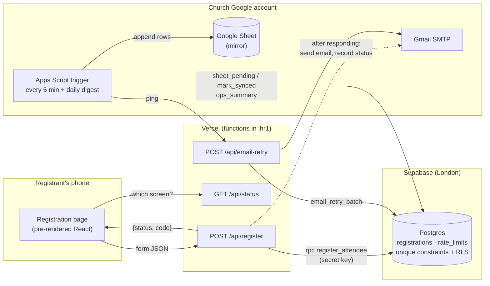

# The Awakening: Registration

Registration site for **The Awakening**, a two-day event by **Citizens of Light Church**, Ilorin.

- **When:** Saturday 31 October 2026 (4PM) and Sunday 1 November 2026 (9AM)
- **Where:** Freedom Dome, Ilesanmi Bus Stop, Tanke, Ilorin
- **Live:** https://the-awakening-rho.vercel.app · **Privacy notice:** https://the-awakening-rho.vercel.app/privacy

Each person who registers gets a unique **4-character raffle code** (e.g. `K7QX`). It's shown on screen as a ticket and emailed to them. Their details are saved in a secure database and mirrored to the church's Google Sheet for headcount, bus planning and follow-up.

> **Status:** live since 8 October 2026. Next milestone: the raffle draw page (M6). See [`docs/PROGRESS.md`](docs/PROGRESS.md).

---

## Contents

- [Features](#features)
- [How it works](#how-it-works)
- [Tech stack](#tech-stack)
- [Repository layout](#repository-layout)
- [Getting started (local development)](#getting-started-local-development)
- [Environment variables](#environment-variables)
- [Commands](#commands)
- [Testing](#testing)
- [Database and migrations](#database-and-migrations)
- [Google Sheet mirror](#google-sheet-mirror)
- [Deployment](#deployment)
- [Operations](#operations)
- [Security and privacy](#security-and-privacy)
- [Reusing for another event](#reusing-for-another-event)
- [Gotchas (read before changing things)](#gotchas-read-before-changing-things)
- [Documentation index](#documentation-index)

---

## Features

**For registrants**
- A mobile-first page designed after the event flyer: starburst, rotating DAY 1 / DAY 2 badges, the title artwork, and the church venue panel
- A short form:
  - full name, gender
  - institution (University of Ilorin or "Other"), department, **level (100–500)**
  - WhatsApp number, email
  - pickup bus (Yes reveals area and address)
  - consent, age confirmation and an optional follow-up opt-in
- Plain-English validation, the same rules in the browser and on the server
- Instant **raffle ticket** with the person's name and code, plus a stamp animation (respects reduced motion)
- A **branded HTML confirmation email** with the same ticket
- **One registration per person**, by phone or email. Trying again shows "already registered" and re-sends the code to the original email; the code is **never** shown on screen for a duplicate.
- Answers survive a page refresh; friendly offline, slow and error states
- **"Opens soon" and "closed" screens**, driven by configurable open and close times
- A "Back to home" button after registering (e.g. to register a friend)
- `/privacy`: a plain-language privacy notice (Nigeria Data Protection Act 2023)

**For the church team**
- Every registration appears in the **Google Sheet** within 5 minutes; the "Awakening → Sync now" menu copies them immediately
- A **daily summary email** at about 7am, plus **alerts** when emails keep failing, the Sheet falls behind, or there's a sign-up spike
- CSV export for backups and the transport team
- A plain-English [admin guide](docs/ADMIN_GUIDE.md)

**Built in**
- Bot traps (honeypot plus a minimum fill time), per-network rate limiting, security headers and CSP
- Pre-rendered HTML for fast first paint on slow phones. Lighthouse mobile: Performance 93, Accessibility 100, Best Practices 100, SEO 100.
- Link previews for WhatsApp, Instagram and X; Event structured data for Google; sitemap and robots.txt

---

## How it works



**One registration, step by step:**
1. The page asks `GET /api/status` whether registration is `open`, `not_open` or `closed`, and shows the form or a panel.
2. On submit, the browser validates with the shared zod schema and POSTs to `/api/register`, adding a honeypot field and how long the form was open.
3. The function checks:
   - configuration
   - the registration window (403 outside it)
   - the rate limit (429)
   - bot signals (a fake "duplicate" reply)
   - the schema (400 with per-field messages)

   Then it calls **one database function**, `register_attendee`.
4. `register_attendee` (Postgres) checks phone and email for duplicates, generates a code from `23456789ABCDEFGHJKMNPQRSTUVWXYZ`, and inserts the row. **Unique constraints** make this safe under simultaneous submits, with no locks.
5. The function returns the code straight away. **Afterwards** (`waitUntil`) it sends the email over Gmail SMTP and records `SENT`, `FAILED` or `LOGGED`.
6. Every 5 minutes, an Apps Script in the church Sheet:
   - copies new rows into the Sheet
   - pings `/api/email-retry` to re-send failed emails (up to 5 attempts)
   - checks `ops_summary` and emails alerts if needed

**Why a database plus a Sheet mirror?** The first design wrote straight to the Sheet through Apps Script with a lock. Load testing showed it handled only one registration every 1–3 seconds, and 4 of 10 simultaneous sign-ups timed out. Postgres handles 50 at once at a p95 of 2.8s, measured from Nigeria. The background is in [`docs/PROJECT_PLAN.md`](docs/PROJECT_PLAN.md) (Revision 2) and [`docs/PROGRESS.md`](docs/PROGRESS.md).

---

## Tech stack

| Layer | Choice |
|---|---|
| Frontend | Vite 8, React 19, TypeScript, Tailwind CSS 4. Build-time pre-rendering plus hydration. |
| Forms and validation | react-hook-form, zod 4 (one schema in `shared/` for page and server) |
| Backend | Vercel Functions (Node ESM) in `api/`, region `lhr1` |
| Database | Supabase Postgres (TEST and LIVE projects), accessed only server-side via `@supabase/supabase-js` and the secret key |
| Sheet mirror and alerts | Google Apps Script (`apps-script/Code.gs`), time-driven triggers |
| Email | Gmail SMTP via nodemailer (church Gmail plus app password). Templates written in React Email and Tailwind, pre-rendered to inline HTML. |
| Icons | lucide-react |
| Tests | Vitest (unit, plus PGlite for real-Postgres migration tests), Playwright (browser), custom load and smoke scripts |
| Lint | oxlint |
| Hosting | Vercel Hobby (free), Supabase Free, Google (free). **Running cost: ₦0.** |

---

## Repository layout

```
api/                      Vercel Functions (each file = one endpoint)
  register.ts             POST /api/register
  status.ts               GET  /api/status
  email-retry.ts          POST /api/email-retry   (Bearer RETRY_SECRET)
  health.ts               GET  /api/health
  _lib/                   shared server code (not endpoints): db, mailer, email template, config checks, http types
apps-script/Code.gs       Sheet mirror, alerts and daily digest (pasted into each Sheet's Apps Script editor)
brand/                    source artwork only; never loaded by the site
docs/                     plan, design system, admin guide, audits, progress log (see the index below)
e2e/                      Playwright smoke tests
emails/Confirmation.tsx   email source (React Email + Tailwind)
public/                   shipped static files: optimised images, self-hosted fonts, og.jpg
scripts/                  dev server, prerender, email build, load test, smoke test, CSV export, OG image, clipboard helper
shared/                   code used by both page and server: event content, zod schema, phone normaliser, window logic
src/                      React app: hero, form, ticket, privacy page, theme tokens
supabase/migrations/      SQL migrations 001–005 (+ .down.sql rollbacks) and their PGlite tests
index.html, privacy.html  the two pages (pre-rendered at build)
vercel.json               region, function limits, clean URLs, security headers
```

---

## Getting started (local development)

### Prerequisites
- **Node.js 24** (the project uses Node's `--env-file`)
- npm
- Access to the **TEST** Supabase project and the TEST Google Sheet (church account)
- On WSL/Windows: PowerShell is used by `scripts/clip.sh` (optional)

### Install and run
```bash
npm install
cp .env.example .env.local      # then fill in the TEST values (see below)
npm run dev:full                # http://localhost:3000, page + /api functions
```

`npm run dev` runs the page only (no `/api`). Use **`npm run dev:full`** for anything that registers. Don't use `vercel dev`: it was slow and didn't load `.env.local` in this setup.

Local development always uses **TEST** (Supabase project `awakening-test` and the TEST Sheet), with `EMAIL_MODE=log`, so no real emails are sent. **Never point local development at LIVE.**

---

## Environment variables

All are **server-side only**. Never prefix a secret with `VITE_`, because `VITE_` values are compiled into the browser bundle.

| Variable | Required | Purpose |
|---|---|---|
| `SUPABASE_URL` | yes | Project URL (TEST locally and on Preview, LIVE on Production) |
| `SUPABASE_SECRET_KEY` | yes | Supabase **secret** key (`sb_secret_…`). Never the publishable key. |
| `EVENT_SLUG` | yes | e.g. `awakening-2026`: lowercase, digits, dashes. Must match the Sheet's Script Property. |
| `EMAIL_MODE` | yes | `log` (dev and preview: nothing is sent) or `smtp`. **Production refuses anything but `smtp`.** |
| `SMTP_USER`, `SMTP_PASS` | for `smtp` | Church Gmail address plus app password |
| `RETRY_SECRET` | yes | Shared with the Apps Script that calls `/api/email-retry` |
| `REGISTRATION_OPENS_AT` | no | ISO 8601 **with an offset**, e.g. `2026-10-13T08:00:00+01:00`. Unset means open now. |
| `REGISTRATION_CLOSES_AT` | no | ISO 8601 with an offset. Production: `2026-11-01T12:00:00+01:00`. |
| `SITE_URL` | no | Absolute site URL for email images when testing SMTP locally. On Vercel it's detected automatically. |
| `RATE_LIMIT_MAX` | no | Overrides the 20-per-10-minutes limit (use `1000` for local load tests) |
| `DRAW_PASSPHRASE` | M6 | Raffle draw page |

`.env.local` (local) and `.env.live` (used by the CSV export) are git-ignored. Vercel only applies environment variable changes to **new deployments**: redeploy after editing.

---

## Commands

| Command | What it does |
|---|---|
| `npm run dev:full` | Local page plus API (`scripts/dev-server.mjs`), env from `.env.local` |
| `npm run dev` | Page only (Vite) |
| `npm run build` | Type check, Vite build, SSR build, then **pre-render** `index.html` and `privacy.html` (CSS inlined) |
| `npm run typecheck` | `tsc -b` across app, api (`nodenext`), configs, emails, e2e |
| `npm run lint` | oxlint |
| `npm test` | All Vitest tests (unit, API, Apps Script, PGlite migrations, email) |
| `npm run test:e2e` | Playwright browser tests (starts its own server on :3200 against TEST) |
| `npm run email:build` | Re-render `emails/Confirmation.tsx` into `api/_lib/email-template.ts`. **Run after any email change.** |
| `node scripts/smoke.mjs <url>` | Checks a **deployed** site: functions, headers, SEO files. Run after every deploy. |
| `node scripts/load-test.mjs --url … --n 50 --email-mode-is-log` | Burst test against TEST (needs `RATE_LIMIT_MAX=1000` on the target) |
| `node --env-file=.env.live scripts/export-registrations.mjs > file.csv` | CSV backup of one event |
| `bash scripts/clip.sh <files…>` | Copy files (e.g. migrations, `Code.gs`) to the Windows clipboard from WSL |
| `python3 scripts/make-og.py <LilitaOne.ttf> <BarlowCondensed-BoldItalic.ttf>` | Rebuild `public/og.jpg` |

**Single tests:**
```bash
npx vitest run api/register.test.ts -t "duplicate"
npx playwright test e2e/registration.spec.ts -g "happy path"
```

---

## Testing

| Layer | Where | Notes |
|---|---|---|
| Unit and API | `shared/*.test.ts`, `api/**/*.test.ts` | Schema rules, phone normalisation, window logic, every `/api/register` path (503/403/429/bot/400/201/duplicate/502), retry auth, config checks, email escaping |
| Database | `supabase/migrations/migrations.test.ts` | Runs **the real migrations** in PGlite (in-process Postgres): duplicates, re-send throttle, code-collision retry, CHECKs, retry claims, rate limit, level, lockdown, rollbacks |
| Apps Script | `apps-script/Code.test.ts` | Runs `Code.gs` against a fake Sheet that coerces values like Google Sheets: leading zeros, `2E45`, formulas, no duplicate rows, alerts, digest |
| Email | `emails/Confirmation.test.ts` | The committed template must match its source; the display font stays off body text |
| Browser | `e2e/registration.spec.ts` | Happy path plus Back to home, bus fields, duplicate (no code shown), refresh keeps answers, closed and opens-soon screens, privacy link. Waits 3s before submitting (bot check). Cleans up `source=e2e` rows. |
| Load | `scripts/load-test.mjs` | 50 simultaneous registrations plus a same-phone race. Fake addresses, so **log mode only**. |
| Deployed | `scripts/smoke.mjs` | Catches problems local tests can't see (e.g. Node ESM resolution on Vercel) |

---

## Database and migrations

The SQL lives in `supabase/migrations/`, numbered and applied **in order**, **TEST first, then LIVE**, in the Supabase SQL Editor. Each file has a matching `.down.sql` rollback.

| Migration | What it adds |
|---|---|
| `001_registrations` | `registrations` table (unique event+phone, event+email, event+code; CHECKs), RLS on with no policies, functions `register_attendee`, `set_email_status`, `email_retry_batch`, `sheet_pending`, `sheet_mark_synced`. EXECUTE for `service_role` only. |
| `002_ops` | Retry claims (`retry_claimed_at`, so overlapping runs can't double-send), `ops_summary` for alerts |
| `003_rate_limit` | `rate_limits` table (salted-hash keys only) and `rate_limit_hit`; `ops_summary.last_hour` |
| `004_harden_defaults` | Revokes public EXECUTE on Supabase's own `rls_auto_enable()` helper (Security Advisor warning) |
| `005_level` | `level` column (100–500 Level); `register_attendee` and `sheet_pending` updated |

**To apply** (from WSL):
```bash
bash scripts/clip.sh supabase/migrations/005_level.sql
```
Then paste into the SQL Editor and click Run.

**Rule:** apply a migration to LIVE **before** deploying code that depends on it.

**Security check after migrating:** every `public` function should show `anon_exec = false` and `auth_exec = false`:
```sql
select p.proname,
       has_function_privilege('anon', p.oid, 'execute') as anon_exec,
       has_function_privilege('authenticated', p.oid, 'execute') as auth_exec
  from pg_proc p join pg_namespace n on n.oid = p.pronamespace
 where n.nspname = 'public' order by 1;
```

---

## Google Sheet mirror

Each environment has its own Sheet ("The Awakening – TEST" and "– LIVE") with `apps-script/Code.gs` pasted into Extensions → Apps Script.

**Script Properties:**

| Property | Value |
|---|---|
| `SUPABASE_URL`, `SUPABASE_SECRET_KEY` | Matching Supabase project |
| `EVENT_SLUG` | Same as Vercel |
| `ALERT_EMAIL` | Who gets alerts and the daily digest (LIVE: `clcchurchmedia@gmail.com`) |
| `IS_LIVE` | `true` on LIVE only |
| `RETRY_URL` | `https://the-awakening-rho.vercel.app/api/email-retry` (LIVE) |
| `RETRY_SECRET` | Same as Vercel |

Then run **`setupSheet`** (it creates the tabs `Registrations`, `Winners`, `Log` and `Deletions`, and appends any new columns) and **`installTrigger`** (a sync every 5 minutes, plus a daily digest at about 7am).

Share the Sheet with leads **as Viewers**: editors can open the script and see the database key. Columns added later (e.g. `level`) go at the **end**, so existing rows never shift.

---

## Deployment

- **Vercel** builds on every push. `main` → **Production** (LIVE settings); other branches → **Preview** (TEST settings, behind Vercel login).
- Functions run in **London (`lhr1`)**, next to the Supabase database (set in `vercel.json`; the dashboard setting alone didn't apply).
- **After every deploy:**
  ```bash
  node scripts/smoke.mjs https://the-awakening-rho.vercel.app
  ```
  For a preview, add `VERCEL_BYPASS=<protection bypass secret>` in front.
- **Rollback:** Vercel → Deployments → the last good Production deployment → ⋯ → **Promote**.
- **Link previews:** `og:image` is `og.jpg?v=<content hash>`, so a new image gets a new URL automatically. After changing it, use **Scrape Again** in the [Facebook Sharing Debugger](https://developers.facebook.com/tools/debug/), which WhatsApp also uses.

---

## Operations

The day-to-day guide for the church team is [`docs/ADMIN_GUIDE.md`](docs/ADMIN_GUIDE.md). In short:
- **Alerts and digest** arrive at `ALERT_EMAIL`. Each alert explains what to do.
- **Change the close time:** edit `REGISTRATION_CLOSES_AT` in Vercel (Production), then redeploy.
- **Backups:** a nightly CSV export from about a week before the event:
  ```bash
  node --env-file=.env.live scripts/export-registrations.mjs > awakening-$(date +%F).csv
  ```
  Restore with Supabase Table Editor → Import CSV.
- **Deletion requests** (NDPA): delete in Supabase and in the Sheet, and log it in the `Deletions` tab.
- **After the event:** delete the Gmail app password, rotate the Supabase secret keys, remove the triggers. See the admin guide §9.

---

## Security and privacy

- **The browser never talks to Supabase.** RLS is on with no policies; every function's EXECUTE is revoked from `anon` and `authenticated`. Only `api/` (secret key) and the Sheet's Apps Script can read or write.
- No secrets in the bundle or in git history (checked in the P04 audit). `npm audit`: 0 vulnerabilities.
- **Server-side validation:** zod plus database CHECK constraints. Parameterised RPC only, so no SQL is built from strings. Email values are HTML-escaped. Sheet and CSV cells are formula-guarded.
- **Abuse protection:**
  - a honeypot and 3s minimum fill time (bots get a fake "duplicate" reply)
  - 20 attempts per network per 10 minutes, keyed on a salted IP hash; it fails open if the limiter errors
  - a spike alert above 120 sign-ups an hour
- **Raffle integrity:** one entry per phone and per email (enforced by the database); duplicates never reveal the code. **Winners must be present and show an ID matching their registered name**, and the team reviews the list for fakes before the draw.
- **Headers:** CSP (`script-src 'self'`), `frame-ancestors 'none'`, nosniff, referrer and permissions policies, HSTS.
- **Privacy:** NDPA-oriented consent, a separate follow-up opt-in, an age confirmation, and the address collected only when a bus is needed. The privacy notice is at `/privacy`. Contact: `clcchurchmedia@gmail.com`.

Audit reports: [`docs/audits/`](docs/audits/) (P03 mid and pre-launch, P04 security, P08 SEO).

---

## Reusing for another event

Follow [`docs/SETUP_NEW_EVENT.md`](docs/SETUP_NEW_EVENT.md). In short:
1. Edit `shared/event.ts`: name, days, venue, programme, institutions, levels, copy.
2. Replace the artwork, regenerate `og.jpg` and run `npm run email:build`.
3. Pick a new `EVENT_SLUG`. The same Supabase projects work, because rows are separated by event.
4. Set up a new Sheet, set the Vercel env vars, deploy, and run the smoke test.

---

## Gotchas (read before changing things)

- **`.js` extensions are required** on every relative import in `api/` and `shared/`. Vercel runs them as native Node ESM, so a missing extension crashes the function in production. Local tests and the dev server *won't* catch it, but `npm run typecheck` (`nodenext`) and `scripts/smoke.mjs` will.
- **The email is pre-rendered.** Edit `emails/Confirmation.tsx`, then run `npm run email:build`. Don't use Tailwind `sm:`/`md:` classes or React Email's `<Font>` (both misbehave; see DESIGN.md §11).
- **Hydration:** the page is pre-rendered. Nothing rendered at first paint may touch `window`. The lazy form mounts only after hydration (`useSyncExternalStore` flag in `App.tsx`), or React throws error #419.
- **Scripts and tests that POST** must send `website: ''` and a realistic `elapsed_ms` (≥ 3000), or they're treated as bots. Load tests need `RATE_LIMIT_MAX=1000` on the target.
- **Never** run the load test with real SMTP: it uses fake addresses.
- **The Sheet coerces values:** phone and code are written with a leading `'`, so leading zeros survive and `2E45` stays text.
- **Vercel env var changes need a redeploy** to take effect.
- **Design tokens** live in `src/styles/theme.css`, mirroring [`docs/DESIGN.md`](docs/DESIGN.md). Use no one-off colours or sizes.

---

## Documentation index

| Doc | For |
|---|---|
| [`docs/ADMIN_GUIDE.md`](docs/ADMIN_GUIDE.md) | Church team: day-to-day use, alerts, deletions, backups |
| [`docs/PROJECT_PLAN.md`](docs/PROJECT_PLAN.md) | Scope, data model, architecture, milestones, decisions |
| [`docs/DESIGN.md`](docs/DESIGN.md) | Design system: tokens, components, motion, email |
| [`docs/PROGRESS.md`](docs/PROGRESS.md) | What changed and when, with test results |
| [`docs/SETUP_NEW_EVENT.md`](docs/SETUP_NEW_EVENT.md) | Reuse checklist |
| [`docs/IDEA_BRIEF.md`](docs/IDEA_BRIEF.md) | Original brief (historical: written before the reschedule) |
| [`docs/CLIENT_QUESTIONS.md`](docs/CLIENT_QUESTIONS.md) | Decisions for the church |
| [`docs/client/PLAN_SUMMARY.md`](docs/client/PLAN_SUMMARY.md) | Non-technical summary for the church |
| [`docs/audits/`](docs/audits/) | Production-readiness, security and SEO audits with fix status |
| [`docs/launch/awakening-qr.png`](docs/launch/awakening-qr.png) | Registration QR code (opens `/?src=qr`) |
| [`CLAUDE.md`](CLAUDE.md) | Guidance for AI coding sessions |

---

Built for Citizens of Light Church by asejik.
