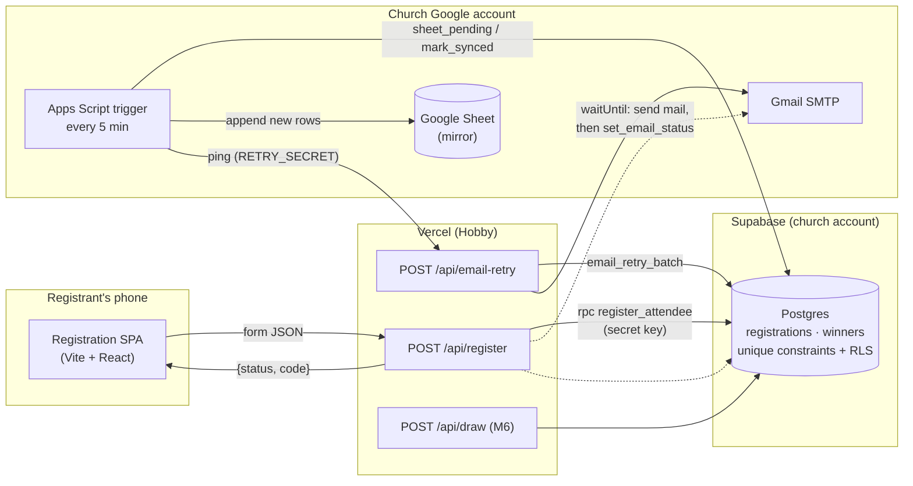

# Project Plan: The Awakening Registration

Mode: NEW · Source: [IDEA_BRIEF.md](IDEA_BRIEF.md) · Client answers: pending ([CLIENT_QUESTIONS.md](CLIENT_QUESTIONS.md)). Recommended defaults are used and marked [ASSUMPTION].
Prepared 2026-10-08. Event: Oct 24–25, 2026. Target launch: **Oct 13**, with a hard fallback deadline of Oct 14.

> **Revision 2 (2026-10-08): Supabase is now where registrations are saved, and the Google Sheet is a mirror.**
> - **Why:** M1 showed the lock-based Apps Script design handles one registration every 1–3s. At only 10 simultaneous submits, 4 of 10 timed out (see PROGRESS.md).
> - **What replaces it:**
>   - Postgres unique constraints do the duplicate checks and keep codes unique, atomically, in about 0.1s.
>   - An Apps Script trigger copies new rows into the church Sheet every 5 minutes.
> - **Approved by the builder.**

---

## 0. Project Profile

| Field | Value |
|---|---|
| Name | The Awakening Registration |
| Type | Client project (internal organisation tool for Citizens of Light Church) |
| Owner | Client: Citizens of Light Church, Ilorin. Builder: asejik |
| Platform | Public, mobile-first website (single-page app plus serverless functions). Not a PWA or native app. |
| Public pages | Yes: registration page, confirmation screen, privacy notice. Protected: raffle draw page (Next tier). |
| Users and scale | About 500 registrants over about 10 days, with bursts after outreach (assume up to 150/day and 50 at once). Fewer than 5 admins. Reused per event afterwards (similar scale). |
| User locations and laws | Ilorin, Nigeria. **Nigeria Data Protection Act 2023 (NDPA).** |
| Languages | English only |
| Data sensitivity | Moderate. Names, phone numbers, emails, gender and home addresses of students, some possibly under 18. No financial or ID data. |
| Payments | None |
| AI features | None |
| Stack | Frontend: Vite + React + TypeScript + Tailwind CSS 4. Backend: Vercel Functions (Node). Database: **Supabase Postgres** (system of record, server-only access), mirrored to a **Google Sheet** by an Apps Script trigger. Auth: none for registrants; shared passphrase for the draw page. Email: Gmail SMTP (nodemailer, app password). Hosting: Vercel Hobby. |
| Key integrations | Supabase (church account); Gmail SMTP (church account); Google Sheet plus an Apps Script time trigger (church account) |
| Environments | dev (local `npm run dev:full` → TEST Supabase project + TEST Sheet, log-only email) · preview (Vercel preview → TEST) · prod (LIVE Supabase project + LIVE Sheet, real email) |
| Rigor level | **STANDARD**: public form holding students' personal data, but short-lived, with no payments or auth. (AUDIT_STANDARD.md not provided; level agreed with the builder.) |

---

## 1. Problem and Outcomes

**Problem.** The church needs a headcount, transport data, a fair raffle and a follow-up list for about 500 freshers attending The Awakening. It wants this on a custom, on-brand page rather than a generic form.

**Goal.** Every registrant gets a unique raffle code on screen and by email within seconds or minutes. Every registration becomes exactly one clean row in the church's Google Sheet.

### Success criteria

| Criterion | Target | How measured |
|---|---|---|
| Live in time | Production URL live by Oct 13 (Oct 14 at the latest) | Deployment date |
| No lost registrations | 100% of "success" screens have a matching Sheet row | Compare success-function log count with Sheet row count daily |
| Email delivered | ≥95% of rows show `email_status = SENT` within 24 hours | Sheet filter on `email_status` |
| No duplicate tickets | 0 duplicate phone numbers or emails in the Sheet | Sheet `COUNTIF` check / pre-draw audit |
| Speed | p95 submit-to-code time under 5s on mobile data | Function logs (duration) |
| Volume | ~500 registrations (church target) | Sheet row count, tracked daily |
| Fair draw | Draw completed on the day with no disputes | Winners tab plus organiser feedback |
| Transport planned | Pickup points decided from Sheet data by Oct 22 | Transport lead confirms |

### User stories

1. **As a fresher**, I want to register in under two minutes on my phone, **so that** I'm counted and entered into the raffle.
   - Form works on a 360px-wide screen; all fields are reachable without horizontal scrolling.
   - Validation errors appear next to the field, in plain English, without clearing my other answers.
   - Submitting with valid data shows my code within 5s (p95).
2. **As a fresher**, I want my raffle code shown on screen and sent to my email, **so that** I can't lose it.
   - The code is shown large, with "Screenshot this" guidance and the event details.
   - An email with the same code arrives, normally within a minute. If it's delayed, it's retried automatically.
   - If email fails, I still see my code on screen.
3. **As a fresher who registers twice by mistake**, I want to be told I'm already registered, **so that** I don't get confused.
   - Re-using a registered phone number or email gives "You're already registered. We've re-sent your code to your email."
   - No new row is created, and the existing code is **not** shown on screen (see §9).
4. **As a church organiser**, I want each registration as a row in our Google Sheet, **so that** I can count attendees, plan buses and follow up.
   - Each row has a timestamp, code, all form fields, consent flags and email status.
   - Sheet access is limited to named leads.
5. **As the raffle host** (Next tier), I want to draw a random code on the projector, **so that** the draw is fair and visible.
   - The draw page needs a passphrase.
   - Drawn codes are never drawn again. The host can mark a winner as "Claimed" or "Absent, redraw".
   - Every draw is recorded in a Winners tab.

### Out of scope
- Registrant accounts or logins
- Payments
- Check-in at the door
- WhatsApp or SMS messages
- Automatic pickup-point assignment
- Admin dashboard (the Sheet is the admin tool)
- Multiple languages
- Offline mode
- Running several events on one deployment (reuse means new settings plus a new Sheet per event, see §5)

### Requirement mapping
No PRD (Mode B). The client's verbal requirements map as follows:

| Requirement | Covered by |
|---|---|
| Registration page for The Awakening | Story 1, Epic A |
| 4-character random code, emailed | Stories 2–3, Epic B |
| Details sent to Google Sheet | Story 4, Epic B |
| Fields: name, gender, department, phone, email, address | Epic A (plus institution, transport need, area and consent from P00) |
| Raffle on the day | Story 5, Epic D (Next) |
| Branded, "excellence" | Epic C |
| Reusable for future events | Epic E |

---

## 2. Features and Scope

| Epic | Feature | Tier | Why |
|---|---|---|---|
| **A. Registration form** | Form with all fields, client-side and server-side validation | MVP | The core job |
| | Conditional address and area fields (only if "Needs bus = Yes") | MVP | Cleaner transport data, less personal data collected |
| | Privacy notice, consent and age checkboxes | MVP | NDPA |
| | Registration open/close by date-time (server-enforced) | MVP | Raffle list must freeze at the draw |
| **B. Code and storage** | Unique 4-character code, look-alike characters removed, enforced by a database unique constraint | MVP | Raffle integrity |
| | De-duplication by normalised phone and email | MVP | One ticket per person |
| | Row saved in Supabase, result returned to the page; copied into the church Sheet within about 5 minutes | MVP | The core job; the church works from the Sheet |
| | Confirmation screen with the code | MVP | Main way people get their code |
| | Confirmation email via Gmail SMTP, sent after the response | MVP | Client requirement |
| | Email status tracking plus automatic retry | MVP | Gmail limits make failures likely on burst days |
| | "Already registered": re-send the code to the email on file | MVP | Handles duplicates without leaking codes |
| **C. Branding** | Flyer-matched design, optimised artwork, event details section | MVP | The reason the client chose a custom page |
| **D. Raffle** | Passphrase-protected draw page, random server-side draw, `winners` table (mirrored to a Winners tab), Claimed/Absent | **Next** (after launch, by Oct 20) | Agreed: build after registration is stable |
| | Projector animation | Next | Nice to have on the day |
| **E. Reuse** | All event content in one config file plus environment variables; an `event` column in the database; Sheet template, Apps Script and SQL migrations in the repo; setup guide | MVP (light) / Later (polish) | Client wants reuse; keep the cost low now |
| | Spam protection: honeypot plus minimum fill time | MVP | Public form |
| | Cloudflare Turnstile, behind a switch | Later (enable only if spam appears) | Extra friction and dependency on slow networks |
| | Admin stats page, CSV export, check-in | Later | The Sheet covers these for now |

---

## 3. Users, Roles and Permissions

| Role | View | Create | Edit | Delete | How they authenticate |
|---|---|---|---|---|---|
| Registrant (public) | Own code (only on the success screen, once) | Own registration | — | Request by emailing the church (manual) | None |
| Organiser / lead | Sheet rows (as shared) | — | Sheet cells (shared editors only) | Sheet rows (owner/editors) | Their Google account, via Sheet sharing |
| Raffle host (Next) | Drawn code plus the winner's first name and institution only | Draw records | Winner status (Claimed/Absent) | — | Shared draw passphrase (server-checked) |
| Builder | Everything (dev and prod) | Deployments, migrations | Code, config | — | Church Google account, Supabase, Vercel, GitHub |
| Church account owner | Everything | — | — | Everything; can revoke the app password, the Supabase secret key and the Apps Script | Church Google account (also used to sign in to Supabase and Vercel) |

**Account lifecycle.** There are no user accounts. Admin access is plain Google Sheet sharing. The draw passphrase is set as an environment variable, changed per event, and removed after the event. The app password is **deleted after the event** (part of close-out), which cuts off email instantly. The Supabase secret key is rotated at close-out too.

---

## 4. Data Model

**System of record: Supabase Postgres**, with one project for TEST and one for LIVE, both under the church account. The **Google Sheet is a read-only mirror** for the church team, copied every 5 minutes. SQL lives in `supabase/migrations/`.

### Table `registrations`
Ownership: the church. Rows are created only by the server-side `register_attendee` function.

| Column | Type | Notes |
|---|---|---|
| `id` | uuid PK, `gen_random_uuid()` | |
| `event` | text, not null | e.g. `awakening-2026`. All unique constraints include it, so the project can be reused for later events. |
| `created_at` / `updated_at` | timestamptz, default `now()` | |
| `code` | text, 4 characters | Alphabet `23456789ABCDEFGHJKMNPQRSTUVWXYZ` (31 characters, 923,521 combinations), enforced by a CHECK. **UNIQUE (event, code).** |
| `full_name` | text ≤ 80 | Trimmed |
| `gender` | text, CHECK in (Male, Female) | |
| `institution` | text | From the config list, or `Other` |
| `institution_other` | text ≤ 80 | Only when `Other` |
| `department` | text ≤ 80 | |
| `phone` | text | Normalised `0XXXXXXXXXX`; CHECK on format. **UNIQUE (event, phone).** |
| `email` | text | Lowercased; CHECK `email = lower(email)`. **UNIQUE (event, email).** |
| `needs_transport` | boolean | |
| `area` | text ≤ 60 | Only when transport = Yes |
| `address` | text ≤ 200 | Only when transport = Yes |
| `consent_at` | timestamptz, not null | |
| `followup_optin` | boolean | Separate opt-in [ASSUMPTION: client Q6] |
| `age_confirmed` | boolean, CHECK true | [ASSUMPTION: client Q7] |
| `source` | text ≤ 40 | `?src=` tag from QR codes or links |
| `email_status` | text, CHECK in (PENDING, SENT, FAILED, LOGGED) | `LOGGED` means log mode (dev/preview), so nothing was sent |
| `email_attempts` | int, default 0 | |
| `emailed_at` | timestamptz | |
| `last_resend_at` | timestamptz | Limits duplicate re-sends to one per 10 minutes (atomic update) |
| `sheet_synced_at` | timestamptz | Set when the row has been copied to the Sheet |

### Table `winners` (M6)
`id`, `event`, `registration_id` (FK), `drawn_at`, `status` (DRAWN / CLAIMED / ABSENT), `round`. UNIQUE (event, registration_id), so nobody is drawn twice.

### Database functions (one round trip each; `service_role` only)
- **`register_attendee(event, fields…)`:**
  - If the phone or email already exists: returns `duplicate`, plus whether a re-send is allowed (an atomic `last_resend_at` update).
  - Otherwise: generates a code and inserts. On a unique violation on `code`, it regenerates. On a violation on phone or email (a same-instant race), it returns `duplicate`.
  - Returns JSON `{status, id, code, email, full_name, resend}`. The code for a duplicate is only for the server to email; it never goes to the browser.
- **`set_email_status(id, status)`:** sets the status and increments `email_attempts`.
- **`email_retry_batch(event)`:** returns rows that are FAILED, or PENDING for over 10 minutes, with `email_attempts` below 5.
- **`sheet_pending(event, limit)`** and **`sheet_mark_synced(ids)`:** used by the Sheet mirror.
- **`ops_summary(event)`** (migration 002): counts for the daily digest and alerts (total, last 24h, unsynced, failed, exhausted, logged, sent). `email_retry_batch` claims its rows (`retry_claimed_at`), so overlapping runs can't double-send.

### Google Sheet mirror (tab `Registrations`)
- **Columns:** `id`, `created_at`, `code`, `full_name`, `gender`, `institution`, `institution_other`, `department`, `phone`, `email`, `needs_transport`, `area`, `address`, `consent_at`, `followup_optin`, `age_confirmed`, `source`, `synced_at`.
- Email delivery status is **not** mirrored. It's tracked in Supabase and checked by the builder.
- `phone` and `code` are written as forced text. M1 found that Sheets drops the leading 0 and would turn `2E45` into a number.
- Rows are appended only if their `id` isn't already in the Sheet, so a retry never creates duplicates.
- Tabs `Winners` (M6) and `Log` stay.

### Standard fields and rules
- IDs and timestamps are on every row. `created_by` doesn't apply (the public creates rows).
- The `event` column acts as the tenant column for reuse. There's no soft delete. Deletion requests are a manual delete in Supabase and in the Sheet. The Supabase Free plan has no downloadable backups (verify this), so the Sheet mirror plus the evening CSV exports are our copies.

### Access rules (designed now)
- **RLS is enabled on every table, with no policies.** The `anon` and `authenticated` roles can do nothing, and EXECUTE on every function is revoked from `public`, `anon` and `authenticated`.
- **Only the server touches the database,** using the **secret key** (or the legacy `service_role` key), which lives in Vercel env. The browser never talks to Supabase, and no Supabase key goes into the bundle.
- **Apps Script** holds the same secret key in Script Properties, on the church account, to read pending rows and mark them synced. It's rotated at close-out.
- The spreadsheet is **private to the church account**, shared by name with at most 3 leads [ASSUMPTION: client Q12]. Never "anyone with the link".
- **Formula guard:** every Sheet value starting with `= + - @` is prefixed with `'`.

### Sensitive data, retention and deletion
- Address and area are collected only when the person needs transport.
- **Retention [ASSUMPTION: client Q15]:** keep for follow-up and membership; review and delete addresses 12 months after the event. This applies in both Supabase and the Sheet.
- Deletion requests go to the church email; the builder deletes the row in Supabase and in the Sheet.
- **Region:** pick the Supabase region nearest the Vercel function region (e.g. London for both), and verify the options. Data is held outside Nigeria, as it already was with Google. The privacy notice names both providers.

### Existing data to import
None.

---

## 5. Tech Stack

### Frontend and function options

| | **Option 1: Vite + React + Vercel Functions** (recommended) | Option 2: Next.js (App Router) |
|---|---|---|
| Cost | Free on Vercel Hobby | Free on Vercel Hobby |
| Learning curve | Lowest: same as `raw-registration` and `fma-registration` | Low: same as `ces` |
| Fit | One page plus two or three functions. A static build means the smallest bundle for low-end phones. | Server rendering, routing and server actions are mostly unused here |
| Local dev | Needs `vercel dev` to run `/api` functions locally | `next dev` runs everything |
| Lock-in | Low (`/api` functions are small Node handlers) | Low to medium (Vercel-optimised features) |
| AI codegen reliability | High | High |
| Reuse | Config file plus env vars | Same |

**Decision: Option 1.** You've shipped this exact shape twice for the same church, and the page doesn't need server rendering. The only cost is running `vercel dev` locally.

### Data and storage
**Revision 2:** Supabase Postgres is where registrations are saved, called **only from Vercel Functions** using the secret key. The church Google Sheet is a mirror, filled by an Apps Script time trigger every 5 minutes.

The original design (an Apps Script web app with a Sheet lock) was dropped after M1 measured 1–3s per registration, one at a time. It's kept in the decisions log (§15).

### Libraries
- `zod` validates on both client and server, from one shared schema
- `react-hook-form` handles the form, as in fma-registration
- `nodemailer` sends email, as in ces
- `@vercel/functions` provides `waitUntil`, so the email is sent after the response
- `@supabase/supabase-js` is used only in `api/`, server-side
- Vitest for unit tests; Playwright for end-to-end tests

**Skipped:**
- **TanStack Query and other state libraries:** one form submit doesn't need them.
- **UI kits:** they fight the custom look.
- **An ORM or Supabase Auth:** the database functions plus supabase-js `rpc()` cover everything; there are no user logins.

### Free tiers: limits, what happens when exceeded, and first paid tier
**All figures should be verified before launch.**

| Service | Relevant limits | When exceeded | First paid tier |
|---|---|---|---|
| Vercel Hobby | **Non-commercial use only**; bandwidth about 100 GB/month; function duration limits apply (check whether the current default and maximum fit `maxDuration`) | Deployments or functions throttled or paused until the next cycle | Pro, about $20/user/month |
| Gmail SMTP (consumer) | About **500 recipients/day** (commonly reported, not confirmed by Google for consumer accounts); rolling 24 hours | Sending blocked for up to 24h; **incoming mail unaffected** | Google Workspace (needs a domain); 2,000/day |
| Supabase Free | 500 MB database; 2 active projects (we use both: TEST and LIVE); **projects pause after about 7 days without activity** (the 5-minute Sheet trigger keeps LIVE active) | Database read-only when over the size limit; a paused project must be resumed from the dashboard | Pro, about $25/month |
| Apps Script (consumer) | Triggers about 90 min/day total runtime (5-minute sync at about 3s per run is about 15 min/day); URL Fetch about 20,000/day | Trigger stops for the day, so the Sheet lags; registration itself is unaffected | Workspace raises the quotas |
| Google Sheets | 10M cells per spreadsheet | N/A at this scale | — |
| GitHub | Free private repos | — | — |

**Pausing:** Supabase Free pauses inactive projects. It doesn't matter during registration. For reuse at a later event, resume the project first (that's in `SETUP_NEW_EVENT.md`).

### Reuse design
- `shared/event.ts` holds everything specific to the event (used by the page and the server):
  - name, tagline, dates, venue, programme
  - institution list, colours, artwork paths
  - email subject and body copy
- Per-event environment variables (§6) set `EVENT_SLUG` and the open and close times. A new event reuses the same Supabase project with a new slug, plus a new Sheet.
- `apps-script/Code.gs` and `supabase/migrations/` live in the repo, along with a `docs/SETUP_NEW_EVENT.md` checklist (written in M5): copy the Sheet template, paste the script, set Script Properties and the trigger, set the env vars, swap the config and artwork.

---

## 6. Architecture

### Flow for one registration
1. The browser validates the form with zod, then sends a POST to `/api/register`. The request includes the honeypot field and the form's open timestamp.
2. The function:
   - re-validates and normalises the phone and email
   - rejects bots (honeypot filled, or form submitted in under 3s)
   - rejects requests when registration is closed
   - calls `register_attendee` (one database round trip). **No lock and no queue:** Postgres unique constraints make duplicate checks and code uniqueness atomic, even for submits at the same instant.
3. The function replies straight away:
   - `created`: returns the code to show on screen
   - `duplicate`: returns "already registered", with no code
4. Using `waitUntil`, the function then sends the email over Gmail SMTP (the new code, or a throttled re-send to **the email on file**), then calls `set_email_status` (SENT / FAILED / LOGGED).
5. **Every 5 minutes,** the Apps Script trigger in the church Sheet:
   - (a) fetches rows not yet copied and appends the ones whose `id` isn't already in the Sheet, in one batch write
   - (b) marks them synced
   - (c) pings `/api/email-retry`, which re-sends FAILED or stale PENDING emails (up to 5 attempts)
   - A **"Sync now"** menu item in the Sheet runs the same thing on demand.

### Server functions

| Endpoint | Purpose | Who can call |
|---|---|---|
| `POST /api/register` | Validate, save via `register_attendee`, return the code, then send the email | Public (honeypot, timing check, closed-window check) |
| `POST /api/email-retry` | Re-send emails from `email_retry_batch` | Apps Script trigger only (shared secret `RETRY_SECRET`) |
| `POST /api/draw` (M6) | Draw a random unused code; mark Claimed or Absent | Raffle host (passphrase `DRAW_PASSPHRASE`); failed attempts limited |

### Client vs server
- **Browser:** rendering, validation (for convenience only), the honeypot field, and showing results.
- **Vercel:** the real validation, normalisation, open/close and bot checks, all database access, SMTP, and the draw passphrase check.
- **Postgres:** uniqueness, code generation, the re-send throttle, and the email retry selection.
- **Apps Script:** only the mirror into the Sheet, and pinging the retry endpoint.

### Secrets: server only, never in the browser bundle
- In Vercel env: `SUPABASE_URL`, `SUPABASE_SECRET_KEY`, `EVENT_SLUG`, `SMTP_USER`, `SMTP_PASS` (app password), `EMAIL_MODE` (`smtp` | `log`), `RETRY_SECRET`, `DRAW_PASSPHRASE`, `REGISTRATION_OPENS_AT`, `REGISTRATION_CLOSES_AT`.
- **No `VITE_` prefix on any secret.** `VITE_` variables are compiled into the bundle.
- In Apps Script Script Properties: `SUPABASE_URL`, `SUPABASE_SECRET_KEY`, `EVENT_SLUG`, `RETRY_URL`, `RETRY_SECRET`.
- **Region:** set the Vercel function region to match the Supabase region (e.g. London for both), to keep the round trip short (verify the available regions).

### What happens when a dependency goes down

| Dependency | If it's down or slow | Behaviour |
|---|---|---|
| Supabase | Registration can't be saved | The function times out after 10s and returns "We couldn't save your registration. Please try again." No code is shown. Logged in Vercel. |
| Gmail SMTP (limit reached or outage) | Email not sent | The registrant already has the code on screen. Row → FAILED; retried every 5 minutes, up to 5 attempts. |
| Apps Script / Google Sheets | The Sheet lags | **Registration is unaffected.** Rows stay `sheet_synced_at = null` and get copied on the next successful run. |
| Vercel | Site down | Nothing works. Fallback: Plan B Google Form (see §14). |

---

## 7. AI Features
N/A: none planned or needed.

---

## 8. Error Handling and Reliability

| Category | What the user sees | What the system does | What's logged |
|---|---|---|---|
| Input validation | Message under each field, e.g. "Enter an 11-digit phone number, e.g. 08012345678." Answers kept. | Same zod schema runs on the server; 400 if invalid | Nothing (normal behaviour) |
| Network or offline at submit | "You seem to be offline. Your answers are saved here. Tap Submit again when connected." | Form state kept in memory, and in `sessionStorage` in case of an accidental refresh | Nothing |
| Slow network | Button shows "Registering…" and is disabled; after 8s, "Still working, please don't close this page" | Client timeout 25s, then the error state | — |
| Database error or timeout | "We couldn't save your registration. Please try again in a minute." | 10s timeout; no automatic retry, and the user retries. Safe, because the unique constraints catch a row that did save. | Vercel log: action, duration, error |
| Bursts (many submits at once) | Same as a normal submit | No lock: Postgres handles concurrent inserts, and uniqueness is enforced by constraints | Durations in the Vercel log |
| SMTP failure or Gmail limit | Nothing new (the code is already on screen) | Row → FAILED; retried every 5 minutes | Vercel log |
| Duplicate submission (double tap) | Button disabled after the first tap | Unique constraints on (event, phone) and (event, email) | — |
| Re-registration | "You're already registered. We've re-sent your code to the email you used." | The re-send is limited (one per 10 minutes) | — |
| Registration closed | The page shows "Registration is closed. See you at The Awakening!" in place of the form | Server returns 403 even if the page is stale | — |
| Bot (honeypot or too fast) | A fake success screen with no code (so the bot learns nothing) | No row written | Count only |
| Partial failure (row saved, response lost) | The user sees an error, retries, and gets "already registered" plus an email | De-duplication makes retries safe | — |
| Sheet mirror fails | Nothing (the public never sees the Sheet) | Rows stay unsynced and are copied on the next run; "Sync now" for organisers | Apps Script executions dashboard |

### Key screen states
- **Form:** idle, submitting, field errors, network error, server error, closed, before opening ("Registration opens on…").
- **Success:** the code shown large, plus the "Screenshot this" prompt, "Check your inbox (and spam)", and the event details with an add-to-calendar link (Later).
- **Draw (Next):** passphrase gate, ready, drawing animation, result, "Claimed" or "Absent, redraw", and "No codes left".

---

## 9. Security, Privacy and Compliance

| Threat | Mitigation |
|---|---|
| Bot or spam flood filling the Sheet and using up email quota | Honeypot field; minimum fill time (3s); emails only go to newly created rows. The Turnstile switch is ready if spam appears. Daily row-count check. |
| Multiple tickets per person | UNIQUE (event, phone) and UNIQUE (event, email) in Postgres |
| **Code harvesting** (entering someone's phone or email to see their code) | Duplicates **never return the code to the browser**; it's only re-sent to the email on file |
| Prize claimed with a screenshot of someone else's code | At the draw, the winner states their full name and phone number, and the host checks the Winners result against the Sheet |
| Direct database access from the internet | RLS on with no policies; function EXECUTE revoked from `anon`/`authenticated`; the secret key only in Vercel env and Script Properties; rotated at close-out |
| `/api/email-retry` abused | Requires `RETRY_SECRET`; it only re-sends to emails already on file, at most 5 attempts per row |
| Secrets leaking into the browser bundle | No secret has a `VITE_` prefix. The pre-launch audit checks the bundle with grep. |
| Formula injection in the Sheet | Prefix leading `= + - @` with `'` before writing |
| Email header or content injection | Fields validated and length-limited; nodemailer builds headers; names escaped in the HTML email |
| Draw page passphrase guessed | Server-side check; failed attempts limited; passphrase changed per event |
| Personal data exposed through Sheet sharing | Named-person sharing only, never link sharing; a pre-launch check of sharing settings |
| Church Gmail compromised through the app password | The app password is used only by Vercel env; **deleted after the event** |

### NDPA 2023 (verify; this isn't legal advice)
- **Privacy notice** on the page, linked next to the consent checkbox. It covers:
  - who collects the data (Citizens of Light Church)
  - what is collected and why (event logistics, transport, raffle, follow-up and membership)
  - who sees it, how long it's kept, and how to request access or deletion (the church email)
- **Consent:** a required checkbox for the event purposes, plus a **separate optional opt-in** for follow-up calls and WhatsApp messages.
- **Minors:** a required "18 or older, or I have my parent/guardian's consent" checkbox [ASSUMPTION: client Q7].
- **Minimise data:** collect address and area only when transport is needed. No date of birth, ID or photos.
- **Access and deletion requests:** handled manually by the church within a reasonable time.
- **Processors:** the privacy notice names the services that store the data on the church's behalf: Supabase (database) and Google (Sheet, email). Both hold data outside Nigeria. Verify what the NDPA requires for cross-border transfer.

---

## 10. Non-Functional Requirements

- **Performance (low-end Android on 3G/4G):**
  - JavaScript under 120 KB gzipped
  - Hero artwork **under 150 KB**. The current flyer PNG is 1.4 MB at 5400px, so export cropped WebP/AVIF at ≤1080px wide with a PNG fallback.
  - At most 2 web fonts, with `font-display: swap`
  - LCP under 2.5s on a simulated "Fast 3G" connection
- **Low-end devices:** no heavy animation libraries; CSS-only effects; works without hover.
- **Accessibility (WCAG 2.2 AA basics):**
  - Labels on every field, and errors linked to their fields
  - Contrast ≥ 4.5:1. Watch cream-on-orange and white-on-orange.
  - Touch targets ≥ 24px (aim for 44px)
  - Visible focus, logical keyboard order
  - The code announced to screen readers on the success screen
  - `autocomplete` attributes (name, email, tel, street-address)
- **SEO:** basic only. Title, description, and an Open Graph image (the flyer) so WhatsApp and social link previews look right. That matters here, because WhatsApp Status is the main channel.
- **Browsers:** Chrome Android, Opera Mini (basic support: the form must at least submit), Safari iOS, and in-app browsers (WhatsApp, Instagram).

---

## 11. Quality and Operations

**Testing:**
- **Unit tests (Vitest), only for logic that can break subtly:**
  - Nigerian phone normalisation (`+234…`, `234…`, `0…`, spaces and dashes)
  - the zod schema, including conditional fields
  - the open/close window check
  - the HTML escaping in the email template
- **End-to-end smoke tests (Playwright), run against preview with the test Sheet and `EMAIL_MODE=log`:**
  1. Happy path: fill in the form, submit, see the code; the row exists in TEST Supabase (and in the TEST Sheet after a sync).
  2. Transport = Yes shows the address and area fields, which then become required.
  3. Duplicate phone number gives the "already registered" message and no code.
  4. Registration closed shows the closed message, and the API returns 403.
  5. (Next) Draw: wrong passphrase is rejected; right passphrase draws an unused code.
- **Load and spike test (M1):** `scripts/load-test.mjs` sends 50 parallel registrations plus a same-phone race to TEST.
- **Database tests:** `supabase/migrations/migrations.test.ts` runs every migration (up and down) in PGlite, an in-process Postgres: duplicates, re-send throttle, code-collision retry, CHECKs, retry claims, `ops_summary`, lockdown. Same-instant races need real connections, so they're covered by the load test against TEST.

**Environments and deployment:**
- A GitHub repo is connected to Vercel. Pull requests and branches create preview deployments using **TEST** (Supabase project and Sheet); `main` deploys to prod using **LIVE**.
- Migrations: SQL files in `supabase/migrations/`, run in the Supabase SQL editor on **TEST first, then LIVE**. Each one notes whether it's ADDITIVE or DESTRUCTIVE, with a rollback.
- Apps Script is pasted into each Sheet. Its trigger is created by running `installTrigger()` once. There's no web app deployment any more.

**Backups:** the Supabase Free plan has no downloadable backups (verify this). The Sheet mirror is a continuous second copy, plus a manual CSV export from Supabase each evening from Oct 20 and before the draw.

**Monitoring:**
- Vercel function logs (errors and durations)
- Apps Script executions dashboard and the `Log` tab (sync failures)
- **Daily digest email at about 7am, plus immediate alerts** from the Apps Script to `ALERT_EMAIL` (P03-01): emails failed 5 times, 10+ failing, Sheet copy over 30 min behind, sync failing, or LIVE emails only logged
- A quick look at Vercel function logs when an alert arrives

**Analytics (tied to success criteria):**
- Vercel Web Analytics (free tier, verify the limits) for page views, so you can work out conversion = rows ÷ visitors
- The `source` column for which outreach channel works

---

## 12. Build Plan

Riskiest first. Every milestone deploys.

| # | Milestone | Effort | Target |
|---|---|---|---|
| M0 | Setup | S | Oct 8 |
| M1 | **Spike: end-to-end pipeline under load** (redo on Supabase, Revision 2) | S–M | Oct 9 |
| M2 | Real form, validation, de-duplication, confirmation | M | Oct 10 |
| M3 | Branding and content (after **P06**) | M | Oct 11 |
| M4 | Hardening: retry, spam protection, open/close, privacy notice, states, tests | M | Oct 12 |
| M5 | Launch (after **P04 + P08 + P03 PRE-LAUNCH**) | S | **Oct 13** |
| M6 | Raffle draw page (Next) | M | Oct 15–19 |
| M7 | Rehearsal, event and close-out | S | Oct 21–31 |

**P07 for every build task.** Run **P03 mid-project after M2**.

### M0: Setup (S)
**Goal:** a Vite + React + TS + Tailwind 4 project in its own git repo, deploying to Vercel.

**Tasks:**
- `git init` inside `the-awakening/`, then create a GitHub repo
- Create the Vercel project; connect the repo
- Create the test Sheet and the prod Sheet in the church account, from a template with the §4 headers
- Create the Apps Script project (bound to each Sheet)
- *(Revision 2)* Create the TEST and LIVE Supabase projects under the church account
- Turn on 2-Step Verification on the church Gmail; create an app password
- Add env vars in Vercel (Preview → test, Production → prod)

**Done when:**
- [ ] Pushing to `main` updates the live `*.vercel.app` URL showing a placeholder page
- [ ] Both Sheets exist in the church Drive, shared with nobody yet
- [ ] The app password exists and is stored only in Vercel env

### M1: Spike, the riskiest part (S–M), redone on Supabase
**First attempt (Apps Script + Sheet lock): failed the load targets.** Details are in PROGRESS.md.

**Goal:** prove function → Supabase (`register_attendee`) → response, then email via SMTP, then mirror to the Sheet. It has to be fast under bursts, land in the inbox, and never lose or duplicate a registration.

**Tasks:**
- `supabase/migrations/001_registrations.sql`: the table, constraints, RLS, and the functions in §4
- `/api/register` on supabase-js `rpc()`
- `set_email_status` after the send
- Apps Script `syncFromSupabase()` plus `installTrigger()` plus the "Sync now" menu
- `/api/email-retry`
- Remove the Apps Script web app code and `api/_lib/gas.ts`
- Load test, inbox test and wrong-password test

**Done when:**
- [ ] One submit creates one row and shows a code, and the email arrives in the **inbox** (not spam) for Gmail and one other provider
- [ ] 50 parallel submits give **50 rows, 50 unique codes, no errors, p95 under 3s** (no retries needed)
- [ ] Same phone, one after the other and at the same instant, gives one row
- [ ] A wrong SMTP password still shows the code, and the row shows FAILED. After fixing the password, the next retry run turns it SENT.
- [ ] Within 5 minutes (or after "Sync now"), every new row appears in the TEST Sheet exactly once, with the phone's leading 0 intact
- [ ] **If any of these fail: stop and re-plan.**

### M2: Real form (M)
**Goal:** all fields, a shared zod schema, conditional transport fields, phone normalisation, the duplicate path, the confirmation screen, and the real email template (plain styling for now).

**Done when:**
- [ ] On a real Android phone, I can register in under 2 minutes and every validation message makes sense
- [ ] Choosing "Other" for institution shows a text box, and "Needs bus = Yes" shows the area and address fields
- [ ] `+234 801 234 5678` and `08012345678` are treated as the same person
- [ ] A duplicate shows "already registered" and re-sends the email, with no code on screen
- [ ] Unit tests pass
- [ ] `public/spike.html` deleted

**Then:** run **P03 (mid-project)**.

### M3: Branding (M)
**Goal:** the page looks like the flyer, loads fast and is accessible. **Run P06 first.**

**Tasks:**
- Optimised artwork and the Open Graph image
- Fonts and colour tokens from the flyer
- Event details section
- Success-screen design
- Branded email template: **full HTML/CSS, responsive on every screen size** (builder requirement 2026-10-08). Tailwind is welcome as an authoring tool, but email clients ignore class-based CSS, so it has to be compiled to inline styles (e.g. a React Email + Tailwind setup that inlines at build time). Test in Gmail (Android app and web) at minimum.

**Done when:**
- [ ] The church contact approves screenshots of the form and success screen (**client sign-off 1**)
- [ ] A Lighthouse mobile run gives Performance ≥ 90 and Accessibility ≥ 95; the hero image is under 150 KB
- [ ] A WhatsApp link preview shows the flyer image and the title

### M4: Hardening (M)
**Tasks:**
- Honeypot and timing check
- Open/close window
- Privacy notice page
- All §8 states
- Formula-injection guard
- Playwright smoke tests 1–4
- `SETUP_NEW_EVENT.md` draft

**Done when:**
- [ ] Setting `REGISTRATION_CLOSES_AT` in the past shows the closed message, and the API refuses requests
- [ ] Turning airplane mode on before submit shows the offline message, and the answers survive
- [ ] Playwright smoke tests pass on preview

### M5: Launch (S)
**Run P04 + P08 + P03 PRE-LAUNCH first.**

**Tasks:**
- Run the migrations on LIVE Supabase; set prod env vars; set LIVE Script Properties (including `ALERT_EMAIL` and `IS_LIVE=true`) and `installTrigger()`
- Check `EVENT_SLUG` is identical in Vercel Production and the LIVE Script Properties (P03-07)
- Verify what Supabase Free provides for backups; export a CSV and rehearse a restore into TEST (P03-08)
- Add a `Deletions` tab to the LIVE Sheet (date, row id, requested via, done by) and the procedure to the admin guide (P03-09)
- Clear any test rows from LIVE (Supabase and Sheet)
- Share the Sheet with the named leads
- QR codes with `?src=` tags for outreach
- Hand the URL and QR codes to the church

**Done when:**
- [ ] A real registration on prod (the builder's own) works end to end, and the test row is then deleted
- [ ] Sheet sharing lists only the named leads
- [ ] The church confirms the go-live (**client sign-off 2**)

### M6: Raffle draw page (M, Next)
**Tasks:**
- `/draw` route with the passphrase gate
- `/api/draw` plus a `winners` migration (draw only among registrations not already drawn)
- Mirror winners to the Winners tab
- Projector-friendly layout and animation
- Playwright test 5

**Done when:**
- [ ] On the venue laptop and projector, the draw shows a code; "Absent" redraws a different code; drawn codes never repeat
- [ ] A wrong passphrase is refused, and after 5 wrong tries the page is locked for 10 minutes
- [ ] The church rehearses it once (**client sign-off 3**)

### M7: Rehearsal, event and close-out (S)
**Tasks:**
- Oct 21–22: final transport export and a draw rehearsal with the event's data
- Close registration at the agreed time
- After the event:
  - delete the app password
  - rotate the Supabase secret key; remove `DRAW_PASSPHRASE` and `RETRY_SECRET`; delete the Apps Script trigger
  - set the page to "closed"
  - archive the Sheet

**Done when:**
- [ ] The app password is deleted (Google account → Security), the closed page is live, and the admin guide has been delivered

---

## 13. Client Delivery

**Calendar.**
- Raw effort is about 4 working days to launch, plus 2–3 days for the draw page.
- With a 30% buffer, launch falls between **Oct 13 and Oct 14**, and the draw page between **Oct 17 and Oct 20**.
- AI-assisted estimates are uncertain. M1 is the moment of truth: if the spike slips past Oct 10, tell the church immediately.

**Review and sign-off points:**

| Sign-off | When | Acceptance |
|---|---|---|
| 1. Design | End of M3 (~Oct 11) | Church approves screenshots of the form, success screen and email |
| 2. Go-live | M5 (~Oct 13) | One real registration works; the church confirms the URL and QR codes |
| 3. Raffle | M6 (by Oct 20) | Rehearsal draw on the venue setup succeeds |

**Change requests.**
- Anything new (fields, pages, SMS, check-in) is requested in writing (WhatsApp is fine).
- The builder replies with its effect on the dates. Work starts only after the church approves.
- **Freeze from Oct 21:** only fixes until the event.

**What the client must provide, and by when:**

| Item | By |
|---|---|
| Answers to CLIENT_QUESTIONS Q1–Q10 (suggested answers apply if there's no reply) | Oct 10 |
| High-resolution logo and flyer source files (if available), plus approval of the privacy and consent wording | Oct 10 |
| Institution list and email wording approval | Oct 11 |
| Names and Google emails of the leads to share the Sheet with | Oct 12 |
| Venue laptop and projector access for the draw rehearsal | Oct 21 |

**Account ownership:**
- The church owns the Google account (Sheets, Apps Script, Gmail).
- **Supabase projects (TEST and LIVE) are created with the church Gmail** (builder has full access).
- **The Vercel account is created with the church Gmail** (builder has full access) [ASSUMPTION: client Q13].
- GitHub repo: builder-owned, with church access on request.
- No domain.

**Handover (by Oct 23):**
- `docs/ADMIN_GUIDE.md`, written for non-technical leads:
  - reading the Sheet (and "Sync now")
  - handling deletion requests
  - running the draw
  - closing registration
  - deleting the app password
- `docs/SETUP_NEW_EVENT.md` for reuse
- Credentials stay in the church account
- **Support period:** through Oct 31

---

## 14. Risks and Open Questions

| Risk | Likelihood | Impact | Mitigation | Early warning sign |
|---|---|---|---|---|
| Gmail SMTP limit reached or blocked on a burst day | Medium | Medium (late emails) | Code shown on screen; retry trigger; emails only to new rows; bots filtered | `FAILED` rows building up; SMTP 421/550 errors in logs |
| Gmail flags the church account for automated sending | Low–Medium | High (church email affected) | Low volume, one email per real person, plain transactional content; delete the app password after the event | Security alert email to the church account |
| Supabase outage or paused project | Low | High | LIVE is kept active by the 5-minute trigger; status checked daily; the Plan B Google Form is still available | 5xx from `/api/register`; Supabase status page |
| Sheet mirror lags or stops (Apps Script quota or outage) | Low–Medium | Low (registration unaffected) | Unsynced rows catch up on the next run; "Sync now"; the builder checks counts daily | Supabase count ≠ Sheet count |
| Secret key in Apps Script leaks | Low | High | Church-only script; Sheet shared only with named leads (Apps Script isn't visible to viewers, but editors can see it: share leads as **viewers** where possible); rotate at close-out | — |
| Emails land in spam | Medium | Medium | Sent from real Gmail (passes Google's own sender checks); plain content; "check spam" on the success screen | M1 inbox test; registrants report it |
| Vercel Hobby "non-commercial" terms | Low | Medium | Free church event; verify the terms; move to the church's own Pro or Netlify if challenged | Vercel notice |
| Not live by Oct 14 | Low–Medium | High | Thin slices; M1 first; **Plan B: a branded Google Form plus Apps Script emailing codes, buildable in under a day** | M2 not done by Oct 11 |
| Low registrations | Medium | Medium (not a tech problem) | `source` tags show which channel works; share daily counts with the church | Fewer than 100 by Oct 18 |
| Spam or fake sign-ups | Low–Medium | Medium | Honeypot and timing; Turnstile switch | Junk names, bursts from one source |
| The church changes fields after launch | Medium | Low–Medium | Change request process; Sheet columns appended, not reordered | WhatsApp requests |

**Decisions still needed:**

| Decision | Who | Default if no answer |
|---|---|---|
| Raffle day, presence rule, walk-ins (Q1–Q3) | Client | Day 2; must be present; redraw if absent; walk-ins can register on their phones until the draw |
| Close time (Q5) | Client | At the draw; transport list frozen the night of Oct 22 |
| Consent and age wording (Q6–Q7) | Client | Suggested wording |
| Institution list (Q8) | Client | UNILORIN, KWASU, Kwara Poly, Al-Hikmah, Other |
| Pickup-point communication (Q11) | Client | WhatsApp broadcast by Oct 22, done by the church |
| Turnstile on or off | Builder | Off unless spam appears |
| ~~Supabase and Vercel function region~~ | Builder (M1) | **Decided:** Supabase West EU (London), plus `"regions": ["lhr1"]` in `vercel.json` (the dashboard setting alone left functions in `iad1`) |

---

## 15. Decisions Log

| Decision | Alternatives | Why this one |
|---|---|---|
| Custom page instead of Google Forms | Google Forms + Apps Script | Client requirement (branding, excellence). Kept as Plan B. |
| Vite + React + Vercel Functions | Next.js | Single page; the builder has shipped this shape twice; smallest bundle |
| ~~Apps Script web app as the data layer~~ (superseded) | Sheets API with a service account | Original choice; dropped in Revision 2 |
| **Supabase Postgres as the system of record; the Sheet as a 5-minute mirror** (Revision 2) | A: keep the Sheet plus lock, with retries; C: Upstash Redis for duplicate checks with the Sheet as the record | M1 measured 1–3s per registration one at a time, and 4 of 10 parallel submits timed out. Postgres constraints make uniqueness atomic in about 0.1s. The builder knows Supabase; ₦0. |
| Sheet mirror by an Apps Script **pull** trigger (every 5 min, batch write) | Push from Vercel after each insert | One batch write instead of many contended appends; registration never waits on Google; easy to re-run |
| All data access **from the server**, never the browser | Browser `no-cors` POST to Apps Script (as in raw-registration); the browser calling Supabase with the anon key | The page needs the real response; keeping RLS fully closed means nothing is exposed |
| Generate the code in Postgres (`register_attendee`) and retry on a unique violation | In Apps Script under a lock (original) | Atomic without a lock; one round trip |
| 4-character code from a 31-character alphabet (no 0/O/1/I/L) | Full A–Z0–9 | Read aloud at the draw and typed on phones; 923k combinations is plenty |
| Gmail SMTP via app password | Apps Script MailApp (100/day); Resend or Brevo (need a domain; gmail.com sender gets spam-foldered) | Highest free limit (about 500/day) from the church's real address, with no domain |
| Send email after the response (`waitUntil`) plus a retry trigger | Send before responding; no retries | The code appears fast; email failures never block or lose a registration |
| Duplicates re-send the code by email, never show it | Show the existing code | Prevents code harvesting by entering someone else's phone or email |
| Area and address only when transport is needed | Always ask for the address | Less personal data; cleaner transport data |
| Reuse via a config file plus env vars plus an `event` column plus a new Sheet per event | Multi-event admin system | Meets "reusable" at almost no cost |
| Draw page after launch (Next tier) | Build it before launch | Registration has to be live first; the draw isn't needed until Oct 24–25 |
| Rigor STANDARD | LIGHT / STRICT | Public form with students' personal data, but no payments or auth, and short-lived |
